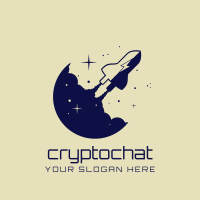
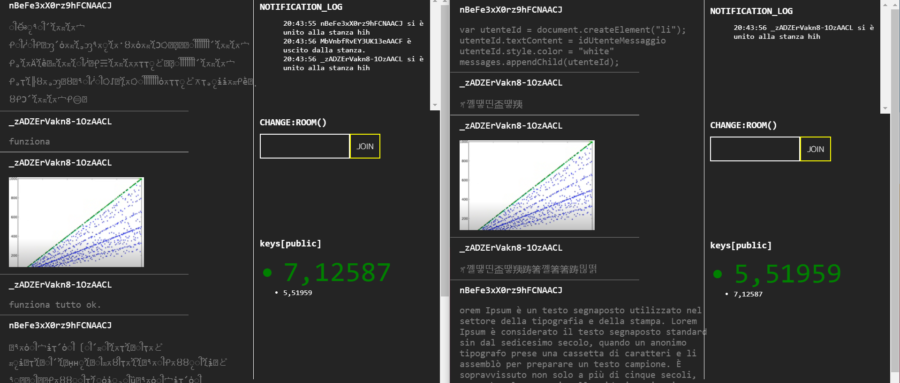

[![MIT License][license-shield]][license-url]
[![LinkedIn][linkedin-shield]](https://www.linkedin.com/in/marco-zanchin-0b7a0a1b5/)

<!-- PROJECT LOGO -->
 

  

  <h3 align="center">Rsa CRYPTO chat</h3>

  

    A end-to-end chat made with socket.io using rsa encryption
     
    <a href="https://github.com/Marcozaa/chat_crittografia"><strong>Explore the docs »</strong></a>
     
     
    <a href="">View Demo</a>
    ·
    <a href="https://github.com/Marcozaa/chat_crittografia/issues">Report Bug</a>
    ·
    <a href="https://github.com/Marcozaa/chat_crittografia/issues">Request Feature</a>
  

<!-- TABLE OF CONTENTS -->

  
Table of Contents

  <ol>
    <li>
      <a href="#about-the-project">About The Project</a>
      <ul>
        <li><a href="#built-with">Built With</a></li>
      </ul>
    </li>
    <li>
      <a href="#getting-started">Getting Started</a>
      <ul>
        <li><a href="#prerequisites">Prerequisites</a></li>
        <li><a href="#installation">Installation</a></li>
      </ul>
    </li>
    <li><a href="#usage">Usage</a></li>
    <li><a href="#roadmap">Roadmap</a></li>
    <li><a href="#contributing">Contributing</a></li>
    <li><a href="#license">License</a></li>
    <li><a href="#contact">Contact</a></li>
    <li><a href="#acknowledgments">Acknowledgments</a></li>
  </ol>

<!-- ABOUT THE PROJECT -->
## About The Project
 

  
 

How to start the project:
* go into the /chat_crittografia folder
* type: node index.js
* type: localhost:3000 in your browser bar 

(<a href="#top">back to top</a>)

### Built With

* [javascript](https://javascript.com/)
* [socket.io](https://socket.io/)
* [node.js](nodejs.org)

(<a href="#top">back to top</a>)

<!-- USAGE EXAMPLES -->
## Usage

- Learn how socket.io works 
- Learn how asymmetric encryption works

(<a href="#top">back to top</a>)

<!-- ROADMAP -->
## Roadmap

- [x] Create online chat app (without encryption)
- [x] Style it
- [x] Add multithreading through public and private key implementation
- [x] Add encryption (m^e % n) and decryption (c^d % n)
- [x] Make data traffic secure
- [x] Image implementation

See the [open issues](https://github.com/Marcozaa/chat_crittografia/issues) for a full list of proposed features (and known issues).

(<a href="#top">back to top</a>)

<!-- CONTRIBUTING -->
## Contributing

Contributions are what make the open source community such an amazing place to learn, inspire, and create. Any contributions you make are **greatly appreciated**.

If you have a suggestion that would make this better, please fork the repo and create a pull request. You can also simply open an issue with the tag "enhancement".
Don't forget to give the project a star! Thanks again!

1. Fork the Project
2. Create your Feature Branch (`git checkout -b feature/AmazingFeature`)
3. Commit your Changes (`git commit -m 'Add some AmazingFeature'`)
4. Push to the Branch (`git push origin feature/AmazingFeature`)
5. Open a Pull Request

(<a href="#top">back to top</a>)

<!-- LICENSE -->
## License

Distributed under the MIT License. See `LICENSE.txt` for more information.

(<a href="#top">back to top</a>)

<!-- CONTACT -->
## Contact

Marco - [@Marco42982395](marcozanchin.com) - marcozanchin2@gmail.com

Project Link: [https://github.com/Marcozaa/chat_crittografia](https://github.com/Marcozaa/chat_crittografia)

(<a href="#top">back to top</a>)

<!-- ACKNOWLEDGMENTS -->
## Acknowledgments

(<a href="#top">back to top</a>)

<!-- MARKDOWN LINKS & IMAGES -->
<!-- https://www.markdownguide.org/basic-syntax/#reference-style-links -->
[contributors-shield]: https://img.shields.io/github/contributors/othneildrew/Best-README-Template.svg?style=for-the-badge
[contributors-url]: https://github.com/othneildrew/Best-README-Template/graphs/contributors
[forks-shield]: https://img.shields.io/github/forks/othneildrew/Best-README-Template.svg?style=for-the-badge
[forks-url]: https://github.com/othneildrew/Best-README-Template/network/members
[stars-shield]: https://img.shields.io/github/stars/othneildrew/Best-README-Template.svg?style=for-the-badge
[stars-url]: https://github.com/othneildrew/Best-README-Template/stargazers
[issues-shield]: https://img.shields.io/github/issues/othneildrew/Best-README-Template.svg?style=for-the-badge
[issues-url]: https://github.com/othneildrew/Best-README-Template/issues
[license-shield]: https://img.shields.io/github/license/othneildrew/Best-README-Template.svg?style=for-the-badge
[license-url]: https://github.com/othneildrew/Best-README-Template/blob/master/LICENSE.txt
[linkedin-shield]: https://img.shields.io/badge/-LinkedIn-black.svg?style=for-the-badge&logo=linkedin&colorB=555
[linkedin-url]: https://linkedin.com/in/othneildrew
[product-screenshot]: images/screenshot.png
